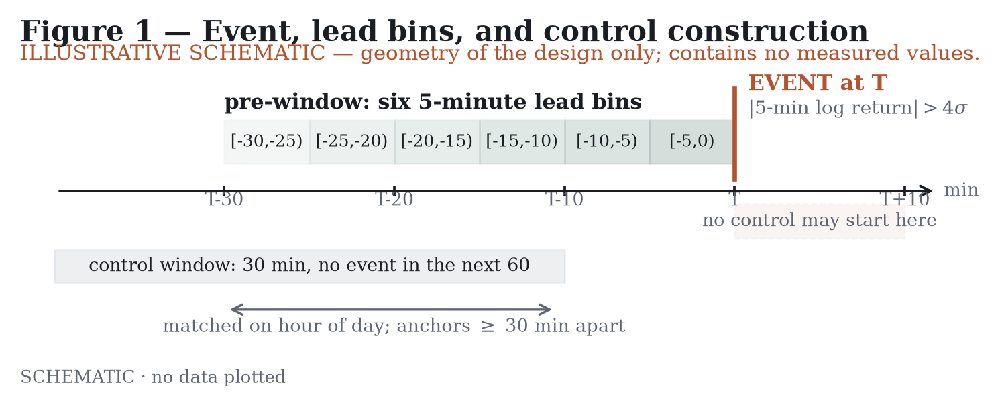
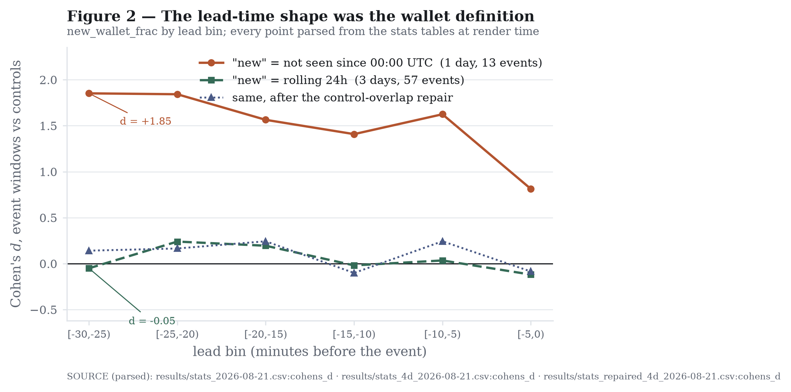
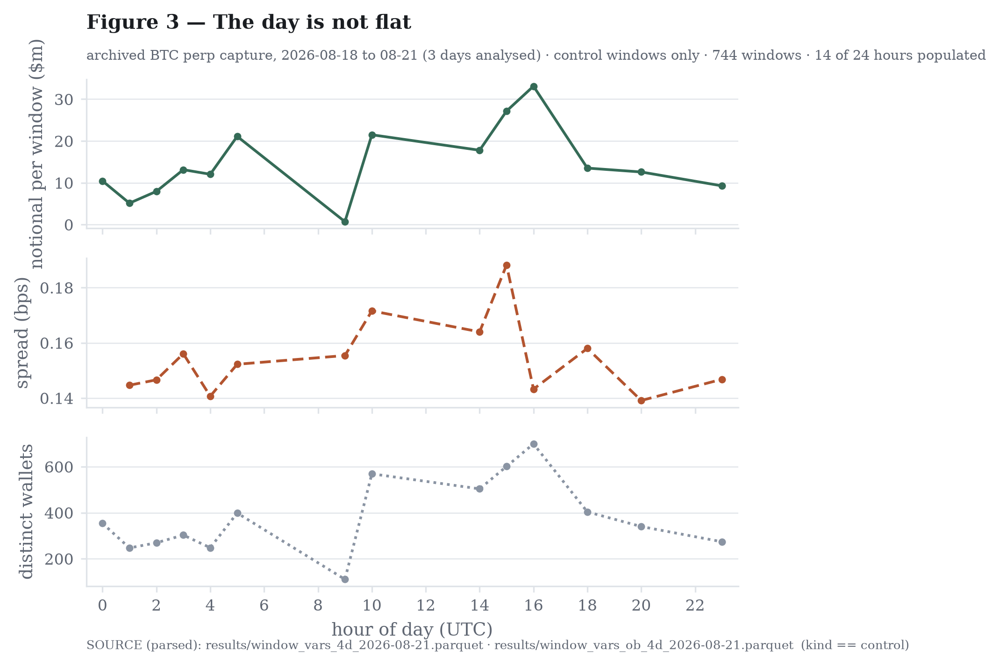
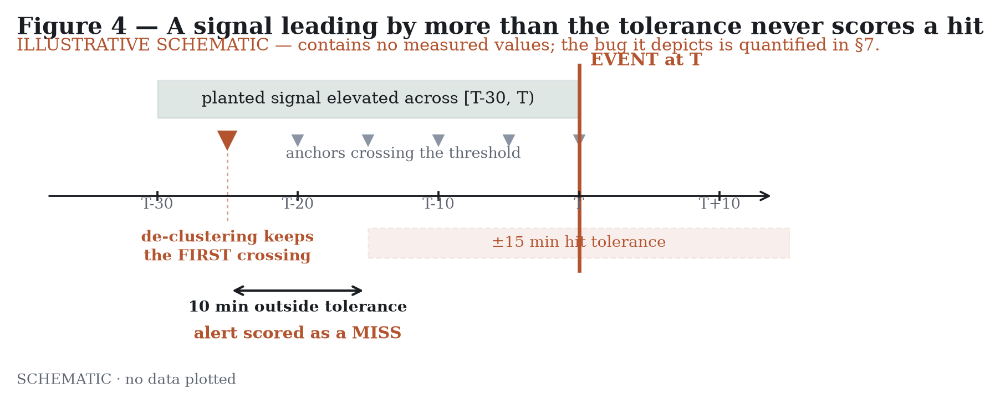
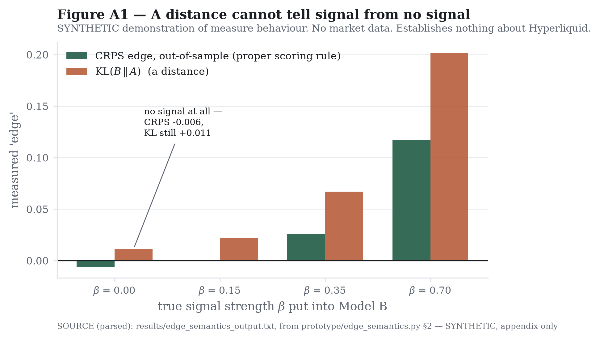

# I Built the Checks. The Checks Were Wrong Too.

**Five failures inside a Hyperliquid forecasting pipeline, from a false wallet
signal to validation tests that failed their own controls**

*Research Note · Hyperliquid forecasting pipeline · August 2026*

---

> **Provenance.** Every figure in this note is either read from an artifact at
> render time or labelled on its face as a schematic carrying no data. Every
> number in the text is sourced from `results/`, from the frozen analysis code,
> or from `EVALUATION_CONTRACT.md`. Where a number the outline called for does
> not exist in the artifacts, it is marked `[NUMBER NOT FOUND]` rather than
> filled in. A note about manufactured results cannot contain one.

---

## 1 — What I'm testing

A candlestick chart shows the outcome of a process. Price moved, and the candle
records that it moved. The question this project asks is whether the process is
visible before the outcome is: whether information in fills, order book state,
and positioning changes measurably *before* a large price move rather than only
during it.

Stated precisely: does market-internal information add predictive value about
price at 5–30 minute horizons, beyond what price and realised volatility
already provide?

**This note does not answer that question.** The primary test is pre-registered
and has not been run. It requires more data than currently exists: the
contract sets the trigger at 30 out-of-sample events, roughly 75 in total, and
the most recent live run had six.

What this note reports is something else. Five occasions on which the attempt
produced a convincing-looking answer that was wrong.

None of them were crashes. Every one produced clean output and plausible
statistics, and two produced results that survived multiple-comparison
correction. They failed at five different layers:

| § | layer | what it produced |
|---|---|---|
| 4 | the data definition | a leading indicator that was a clock |
| 5 | the experimental design | 63 of 120 tests "significant" |
| 6 | the metric implementation | a perfect classifier made of zeros |
| 7 | the validation machinery | guards that could not detect anything |
| A | the definition of "better" | edge measured on pure noise |

The fourth is the one I did not expect. I built the guards specifically to
catch the first three, and the guards had the same disease.

The fifth is not a bug at all but a definition, and it is established on
synthetic inputs rather than on market data. It therefore sits in Appendix A
rather than in the body, for the reason given there.

Total egress cost of the archived analysis: **$0.26**, across four days of
requester-pays downloads. The expense here was never compute.

## 2 — What's already known

The claim that order flow carries information about price is old, well
supported, and was posed from the beginning as a question about *timing*. Kyle
(1985) opens by asking "how quickly is new private information about the
underlying value of a speculative commodity incorporated into market prices?"
In his model an informed trader conceals himself inside uninformed volume;
noise traders "provide camouflage which enables the insider to make profits at
their expense", so he trades gradually rather than all at once. The result is
about timing: "The informed trader trades in such a way that his private
information is incorporated into prices gradually," at a constant rate in the
continuous limit, with all of it in price by the end of trading. Glosten and
Milgrom (1985) reach a similar destination by another route: adverse selection
alone produces a bid–ask spread, even for a risk-neutral market maker earning
zero expected profit, and transaction prices thereby convey information.

The modern empirical version is sharper. Cont, Kukanov and Stoikov (2014)
regress 10-second mid-price changes on order flow imbalance — the net change in
queue size at the best bid and ask — across 50 S&P 500 stocks, and report an
average R² of 65%, stable across stocks and across timescales from under a
second to ten minutes. Over short intervals, order flow does not merely
correlate with price; it accounts for most of the variation.

**That result is contemporaneous.** They regress the price change over an
interval on the order flow imbalance over *the same* interval, their text
describes OFI*k* as "the contemporaneous order flow imbalances." Explaining a
move as it happens is not the same as seeing it coming, and the second is what
this project asks about.

The prior work closest to that question is VPIN. Easley, López de Prado and
O'Hara (2012) state that "VPIN predicts short-term toxicity-induced
volatility, particularly as it relates to large price moves". That is our
question, on another venue. It is also contested. Andersen and Bondarenko
(2014) argue the metric is "by construction, highly correlated with recent
innovations to trading volume and return volatility," and that once current
volume and volatility are controlled for there is "no evidence of incremental
predictive power of VPIN for future volatility." Easley and co-authors
replied, disputing this; the exchange is unresolved. What matters here is that
the dispute is about **controls**, not about effect size. That is why sections
5 and 7 of this note are about controls rather than about how large anything
was.

Three things differ in what follows. **The venue:** Hyperliquid trades
perpetual futures, the most popular cryptocurrency derivative (He et al. 2024),
and is fully on-chain, so per-fill wallet identity and labelled liquidations are
recorded rather than reconstructed from a leverage model. **The horizon:** 5–30
minutes *ahead of* a large move, not ten seconds around one. **The shape:** what
this project looks for is a *localised* pre-move signature: a variable that
separates in a specific lead bin. That is not what Kyle's model predicts.
Information arriving at a constant rate produces no bin in particular, and a
result that concentrates in one bin is therefore as much a reason for suspicion
as for interest. Section 4 is what happened the first time one did.

Whether on-chain observability changes any previously-tested result is open. The
nearest recent work I could verify — Garcia Seuma (2026), an unrefereed
preprint — tests early-warning signals before seven crypto-perpetual
liquidation cascades and reports that "No variable is event-invariant," using
Binance data rather than an on-chain venue. I found no verified study testing
these quantities where wallet identity is directly observable.

One caution frames all of it. Gould et al. (2013), surveying the limit order
book literature, note that "different studies often present conflicting
conclusions," attributing this to differences in matching algorithms, asset
classes, liquidity, and data quality. A result on one venue over a few days is
a result on one venue over a few days.

---

**References.** Every entry below was verified against the publisher, arXiv, or
Crossref record, and every quotation above was read from the body text of the
paper rather than from its abstract, for Kyle, off the rendered pages of the
scan. Anything not verifiable to that standard was to be dropped rather than
cited; the one source that nearly was, and why that would have been a mistake,
is in `AUDIT.md` (A9).

- Andersen, T. G., & Bondarenko, O. (2014). Reflecting on the VPIN dispute.
  *Journal of Financial Markets*, 17, 53–64. doi:10.1016/j.finmar.2013.08.002
  — summarising Andersen & Bondarenko (2014), VPIN and the flash crash,
  *Journal of Financial Markets*, 17, 1–46. doi:10.1016/j.finmar.2013.05.005
- Cont, R., Kukanov, A., & Stoikov, S. (2014). The price impact of order book
  events. *Journal of Financial Econometrics*, 12(1), 47–88.
  doi:10.1093/jjfinec/nbt003
- Easley, D., López de Prado, M. M., & O'Hara, M. (2012). Flow toxicity and
  liquidity in a high-frequency world. *Review of Financial Studies*, 25(5),
  1457–1493. doi:10.1093/rfs/hhs053
- Easley, D., López de Prado, M. M., & O'Hara, M. (2014). VPIN and the flash
  crash: A rejoinder. *Journal of Financial Markets*, 17, 47–52.
  doi:10.1016/j.finmar.2013.06.007
- Garcia Seuma, R. M. (2026). Where does the criticality live? Early-warning
  signals are event-heterogeneous across seven crypto-perpetual liquidation
  cascades. arXiv:2607.27070. *Preprint; not peer reviewed.*
- Glosten, L. R., & Milgrom, P. R. (1985). Bid, ask and transaction prices in a
  specialist market with heterogeneously informed traders. *Journal of
  Financial Economics*, 14(1), 71–100. doi:10.1016/0304-405X(85)90044-3
- Gould, M. D., Porter, M. A., Williams, S., McDonald, M., Fenn, D. J., &
  Howison, S. D. (2013). Limit order books. *Quantitative Finance*, 13(11),
  1709–1742. doi:10.1080/14697688.2013.803148
- He, S., Manela, A., Ross, O., & von Wachter, V. (2024). Fundamentals of
  perpetual futures. arXiv:2212.06888v6. *Preprint; not peer reviewed.*
- Kyle, A. S. (1985). Continuous auctions and insider trading. *Econometrica*,
  53(6), 1315–1336. doi:10.2307/1913210 — quoted from pp. 1315–1316; see
  `sources/README.md` for how the scan was read.

## 3 — Setup

Everything in the sections that follow refers back to this one.

### Data

Archived fills and 1-second candles for the BTC perpetual on Hyperliquid,
retrieved from a public requester-pays S3 archive. Four consecutive days,
**2026-08-18 → 2026-08-21**. Only three are analysed: the first supplies the
trailing lookback and is never itself tested. Live capture at higher resolution
runs separately and is not used in this note.

Four-day archive volume: **2,252,025,001 bytes**, verified byte-exact against
local files after download.

One schema fact changed every number in the study. **Each trade appears twice,
once per counterparty.** All 6,454,874 `trade_id`s have exactly two rows, with
opposite `side`, opposite `crossed`, and identical price and size. The
aggressor is the `crossed = true` row, confirmed through fees: mean fee 0.8954
for `crossed = true` against 0.0071 for `crossed = false`, with maker fees going
negative to a minimum of −183.88. Every figure in this note uses taker rows
only. Had that gone unread, volume would have doubled and buy/sell aggressor
imbalance would have been identically zero, `side` splits exactly 50/50 across
the raw file precisely because both sides are present.

### Events

An event is a price move large enough to be worth predicting, defined
mechanically so the same rule produces the same list on every run:

| step | rule |
|---|---|
| bars | 1-second candles rolled up to 1-minute |
| σ | rolling stdev of 1-minute log returns, trailing 360 minutes |
| event | absolute log return over any 5-minute window exceeding 4σ |
| de-duplication | keep the largest move in any 30-minute cluster |

**Events across the three analysed days: 57**, distributed 20 / 20 / 17 by day.

The event list is written to disk *before any variable is computed*. This
ordering is not cosmetic. If events are labelled after the variables are in
hand, threshold choices can drift toward whatever produces a result, and
nothing in the output would reveal it. Freezing the list first makes that drift
visible if it happens.

One spec observation, recorded at the time and not adjusted: the rule compares
a *5-minute* return against 4× the standard deviation of *1-minute* returns.
Under a random walk a 5-minute return has standard deviation ≈ √5 × σ₁ₘ, so
4 × σ₁ₘ is ≈ 1.8σ in 5-minute terms: a considerably looser bar than "4 sigma"
sounds. It was implemented exactly as specified. Noting it as an observation
about the specification, not as a change to it.

### Controls

For each event at time T, the pre-window runs from T−30min to T, divided into
six 5-minute lead bins.

**Control construction** is where most of the difficulty in this design lives,
and it is worth being explicit about, because §5 is entirely about getting it
wrong. A control window is a stretch of ordinary market that the event windows
are compared against. Choosing them badly does not add noise: noise would wash
out across 57 events. It introduces a systematic difference with a consistent
sign, which survives every statistical correction you can apply, because the
difference is real. It just isn't the difference you're claiming to measure.

The rules: 30-minute windows with no event in the following 60 minutes, no
overlap with any event pre-window, at least 20 drawn per event, restricted to
the region where the detector is live, and **matched on hour of day**. The
three-day run uses **744** such controls.



**Figure 1** — Event, lead bins, and control construction. Schematic; no data.

### Statistical apparatus

Each of these is present for a specific reason.

**Benjamini-Hochberg correction.** The study runs 120 tests (20 variables
across 6 lead bins), so roughly 6 will clear p < 0.05 by chance alone. BH
adjusts the threshold for how many tests were run, and is reported as q. It is
worth being clear about what BH does *not* do: it controls false discoveries
arising from noise. It does nothing whatever about a confound that shifts many
variables in the same direction at once. Section 5 is a case where 63 of 120
tests survived BH and the correction was working perfectly: it was answering a
question about noise, and the problem was not noise.

**Placebo events.** The entire analysis re-run against deliberately fake events
that contain no information about price by construction, drawn at the same
hours as the real ones. A genuine event-linked signal should separate itself
from that null. One that doesn't is indistinguishable from the analysis finding
structure in the background.

**Power.** The probability that a test detects an effect of a given size, given
the sample. It is the reason a null result is not automatically informative: a
study with low power fails to find things that are there. Every null in this
note is quoted against the effect size the design could actually have caught.

**Sensitivity floor.** The smallest effect the pipeline reliably recovers at the
current sample size, measured by planting known signals rather than assumed
from a formula. Section 7 covers how this is measured, and why the number came
out worse than the formula suggested.

**Coverage-matched precision floor.** For any variable proposed as an alert:
how often it fires, against how often events occur, compared against a random
alert *covering the same fraction of time*. A global chance floor is not
sufficient. Section 7 shows what happens when you use one.

**Out-of-sample scoring.** Models compared on data they were not fitted to.
Appendix A shows, on synthetic inputs, that this is not a refinement but the
entire difference between a measure that works and one that reports improvement
on pure noise.

Cohen's d and q appear throughout without further gloss.

## 4 — How I Manufactured a Signal That Wasn't There

*The data definition lied.*

**The signal wasn't a signal. It was a clock.**

For about four days I thought I had found the thing I was looking for.

The variable was `new_wallet_frac`: the share of wallets trading in a window
that I had not seen trade before. On one day of BTC fills it separated
pre-event windows from ordinary ones at d = 1.85, q = 0.0025.

What made it interesting was not the size. It was the shape.

Every other variable I measured — aggressor volume, trade count, size
distribution, liquidations — did the same unhelpful thing. Nothing at 30
minutes out. Something around 15. A spike in the final five. That profile
describes a thermometer noticing a fire, not a smoke alarm. By the time it
registers, the move is already happening and there is nothing to do with it.

`new_wallet_frac` ran the other way. Strongest at 25–30 minutes out, fading to
nothing by the time price actually moved, d = 1.85 at `[-30,-25)` decaying to
d = 0.81 and non-significant at `[-5,0)` (q = 0.381). That is what a leading
indicator is supposed to look like, and it was the only variable that did it.

Then I looked at the definition.

"New" meant "not seen since 00:00 UTC". That definition decays mechanically
through the day: by evening you have already encountered most of the day's
active wallets, so fewer remain that can qualify as new. Measured across the
day, the variable fell from 0.529 at 00h to 0.087 at 21h, correlating with
minute-of-day at **r = −0.643** (the one-day report rounds this to −0.64; the
three-decimal figure is in the comparison table of the three-day report).

My events clustered in the morning. My controls did not.

So I recomputed it with a rolling 24-hour lookback. That change also required
moving from one day to three, which, as §5 explains, was what finally made
properly hour-matched controls possible. Two things improved at once: the
wallet definition, and the comparison it was being tested against. Their
contributions cannot be separated from what was run, and I am not going to
pretend otherwise.



**Figure 2** — The lead-time profile before and after the definition change.

**Table 1 — `new_wallet_frac` with a rolling 24h lookback: 57 events, 744 hour-matched controls**

| lead bin | event mean | control mean | ratio | d | q (BH) | placebo p |
|---|---:|---:|---:|---:|---:|---:|
| **[-30,-25)** | 0.1308 | 0.1328 | 0.984 | **-0.05** | 0.911 | 0.806 |
| [-25,-20) | 0.1435 | 0.1337 | 1.073 | +0.24 | 0.430 | 0.069 |
| [-20,-15) | 0.1412 | 0.1331 | 1.061 | +0.19 | 0.517 | 0.093 |
| [-15,-10) | 0.1322 | 0.1330 | 0.994 | -0.02 | 0.942 | 0.913 |
| [-10,-5) | 0.1345 | 0.1331 | 1.011 | +0.03 | 0.895 | 0.821 |
| [-5,0) | 0.1274 | 0.1323 | 0.963 | -0.12 | 0.523 | 0.215 |

Columns through `q (BH)` are the full 57-event comparison from
`stats_4d_2026-08-21.csv`. The placebo column is necessarily the
strict hour-matched subset from `targeted_4d_2026-08-21.csv`, because
that is the only sample a placebo can be built on; it is a different
sample and is labelled as one.

Not one cell survives correction, and no cell separates from the hour-matched
placebo at 0.05. At the earliest bin the effect is not merely non-significant;
it is very slightly the wrong way round.

The confound is measurably gone. Within-day correlation with minute-of-day fell
from −0.643 under the old definition to **−0.097, −0.078 and −0.191** across the
three analysed days, and the hourly profile flattened from a 0.529 → 0.087 slide
to a range of **0.114–0.149** across all 24 hours. One residual is worth naming:
the daily mean still drifts down across the three days, 0.161 → 0.128 → 0.110.
That is a slow multi-day trend rather than the within-day sawtooth, and since
events and controls are both spread across all three days it is largely
balanced. It could not be hiding anything here in any case: the measured
effect is approximately zero in both directions.

The obvious objection is that the second test simply had different data and got
unlucky. It does not hold, and this is exactly the case where quoting power
matters. At 57 events against 744 controls the design had complete power to
detect d = 0.8, both at p < 0.05 and at the stricter alpha BH effectively
imposes on a mid-ranked test. That is well below the 1.85 I was chasing.
**If the original effect had been real at anything near the size claimed, it
could not have hidden from the second test.**

One cell is genuinely unresolved. `[-25,-20)` sits at d = +0.23 with placebo
p = 0.069: too small to distinguish from nothing at this sample size, and
equally consistent with a small real effect. The power table says why, at 57
events, d = 0.2 is detected 31% of the time before correction and 4% after,
d = 0.3 is 59% and 15%. Separating those two possibilities needs roughly
**250–400 events**, about 15–25 trading days. I am not counting it either way.

## 5 — I Was Comparing Mornings With Afternoons

*The experimental design lied.*

On the one-day run, **63 of 120 tests survived BH correction**. Seventy-one had
raw p < 0.05, against roughly six expected by chance.

That should have felt good. It did not, because it is not plausible. If half an
arbitrary set of variables genuinely carried information about the next thirty
minutes of price, someone would have noticed before me.

So I stopped looking at what the variables measured and looked at *when* they
were measured.

Ten of the thirteen events fell between **06:45 and 14:25 UTC**, mean hour 12.2.
The controls concentrated at hours 10, 14, 15, 17, 19 and 20, mean hour 16.7.
Not because I chose that. Because one day physically cannot supply same-hour
controls: each hour offers 60 candidate minutes, and excluding the windows
around events consumes most of them. **Hour 9 yielded zero usable controls.** To
obtain any at all, the matching tolerance had to stretch to ±5–7 hours for the
morning events.

Every comparison I was making had a four-and-a-half-hour offset built into it.

The analogy is measuring whether a promotion makes a restaurant busier, where
every promotion night is compared against a control sample taken at 10am. You
will find a huge effect. It is dinner.



**Figure 3** — Volume, spread and participation across the day, measured from
the control windows themselves rather than asserted.

One result in that figure is **new to this note and not stated in any run
report**: across the three analysed days, only **14 of 24 hours contain any
control window at all**. That is derived here directly from
the derived window-variable table by counting distinct populated hours among
the 744 control windows, and it is reported as a derivation rather than as a
quotation. It is the same scarcity that forced the matching tolerance open,
measured on the corrected three-day run rather than on the one-day run where the
problem was first noticed. The constraint did not go away when the
matching improved. It got survivable.

This is why an unmatched control is not merely a noisy one. Noise across 57
events washes out. A systematic difference with a consistent sign does not, and
it survives BH, because BH is designed to suppress false positives arising from
randomness and this difference is not random. It is real. It is simply the
difference between morning and afternoon rather than the difference between
pre-event and ordinary.

Three days supplied enough candidate windows to match properly. **24 of 57
events matched strictly within-hour** and the remainder at ±1–2 hours, against
±5–7 hours before.

**Table 2 — What the fix cost**

| | one day | three days |
|---|---:|---:|
| Events | 13 | 57 |
| Controls | 214 | 744 |
| Raw p < 0.05 | 71 / 120 | 28 / 120 |
| BH survivors | 63 / 120 | **25 / 120** |
| Mean event hour | 12.2 | 10.2 |
| Mean control hour | 16.7 | 10.6 |
| Matching tolerance | ±5–7 h | 24 strict, rest ±1–2 h |
| Events retained by strict placebo | 5 of 13 | 48 of 57 |
| Best precision lift over chance | +0.417 | +0.230 |

Both columns are recomputed here directly from `results/stats_2026-08-21.csv`
and `results/stats_4d_2026-08-21.csv` rather than transcribed from the run
reports, and they agree with them.

No variable was added, removed, or redefined between those two columns. Roughly
sixty percent of the apparent findings disappeared once the time-of-day
mismatch was corrected. So did most of the apparent precision: the best cell on
one day showed a lift of +0.417 over the chance floor, and the best cell on
three days shows +0.230.

The strict placebo line is the one I would draw attention to. On one day, the
placebo test that was supposed to validate everything could only be constructed
from 5 of 13 events, because for events at hours 6, 7, 8, 9 and 22 every
eligible minute was already within 30 minutes of an event. A guard running on
5 events is close to no guard at all. On three days it retains 48 of 57 and
becomes a real test. This is the same underlying scarcity problem as the
control matching, showing up in the validation layer instead of the design
layer. Section 7 is about what happens when that goes unnoticed.

**Both columns were later superseded again.** The control-overlap repair of
2026-08-26 cut the three-day BH survivors from 25 to **3 / 120**, all three in
`[-5,0)`. The paragraph below describes the pre-repair picture, which is what
the time-of-day fix alone produced; §8 carries the repaired numbers.

And the 25 survivors that remain are not a consolation prize. **Fifteen of them
live in `[-5,0)`** — the bin closest to the move, where mean |d| across all
variables jumps to 0.929 against 0.281 in the preceding bin. That is the
profile of detection, not anticipation.

After fixing the controls, the market still became easier to recognise as it
moved. What I had not shown was that it became easier to predict before it
moved.

## 6 — A Useless Variable Scored Perfectly

*The statistic lied.*

`liq_count` — the number of liquidations in a window — posted an **AUC of 1.000
in every single lead bin**.

A perfect classifier. Six times in a row.

It was a column of zeros. The archive pipeline reads liquidations from the
`is_liquidation` field in the fills schema; the live websocket `trades` channel
does not carry that field, so on the live feed every value was identical.

The mechanism was in my own AUC implementation, which assigned ranks by array
position rather than averaging ranks across ties. With every value tied, the
positive class took ranks 1…n, the statistic came out 0, and the
direction-agnostic flip — the step that lets a variable count as informative
whether it points up or down — turned 0 into 1.0.

A variable containing no information scored perfectly. And it scored perfectly
*consistently*, in every bin, which is precisely the property that makes a
result look like a finding rather than like noise. A single 1.000 invites
suspicion. Six of them look like a mechanism.

The fix has two parts, and only having both is sufficient: average ranks for
ties via `scipy.stats.rankdata`, and outright exclusion of zero-variance
variables before any ranking statistic runs. Verified at the three boundaries,
all values tied gives 0.500, perfect separation gives 1.000, no separation
gives 0.500.

With tie handling corrected and zero-variance columns excluded, the best-variable
edge of Model B over the volatility baseline across the six lead bins came out
between **−0.093 and +0.025**, and the pipeline declined to report any of it,
on the grounds that six events is below the thirty-event minimum. (That range is
from the live pipeline re-run after the 2026-08-26 control repair, on 34
non-overlapping controls; the pre-repair run on 157 overlapping controls gave
−0.109 to +0.010. Neither is reportable and the repair does not change that.)

The failure mode here is not a crash, an exception, or a NaN. It is a beautiful
number, and it would have survived to publication. `liq_count` remains declared
in the pre-registered feature list for exactly that reason, §10 returns to why
a known-dead variable is better left visible than quietly deleted.

## 7 — I Built the Checks. The Checks Were Wrong Too.

*The guards lied, twice, and the second time because I had just fixed the
first.*

After the AUC bug I built a meta-test suite: guards against exactly that class
of failure. Adversarial inputs — all-zero features, constant features, pure
noise, shuffled labels, rare events — which the pipeline must refuse to find
significance in.

Then I noticed the gap in it. **A guard suite that never fires is
indistinguishable from a guard suite that is broken.** A null result cannot tell
you which one you have. Every adversarial test I had written produced a null,
and I had been reading that as evidence the guards worked.

So the suite has to run in the other direction as well: plant a signal that
genuinely predicts the events by construction, at several effect sizes, and
confirm the pipeline finds it. The plant is injected as a *time series* —
elevated during real event pre-windows, ordinary elsewhere — so that placebo
windows genuinely do not see it. A per-window label would have passed the
placebo test trivially and taught nothing. Amplitude is calibrated per trial
against the measured standard deviation of the control-window statistic, and
the realised effect size is measured and reported next to the target.

Both of the following bugs were found this way. Neither was visible from a null
result, and both were in the guards rather than in the thing being guarded.

### The first failure

Planted signal at d = 2.0, as obvious as a signal gets. Precision lift:
**−0.014**.

A perfect signal scored nothing.

The cause was in the de-clustering logic. When a variable crosses its threshold
repeatedly, consecutive alerts are collapsed into one, and the implementation
kept the *first* crossing. A signal elevated across the whole 30-minute
pre-window first crosses about 25 minutes out, outside the ±15-minute hit
tolerance. The alert was therefore never scored as a hit.



**Figure 4** — Why the bug was invisible: the alert fires correctly, in the
right place, for the right reason, and lands outside the window in which a hit
can be recorded. Schematic; no data.

**Any signal leading by more than the hit tolerance could never register.** The
precision bar was structurally unreachable for exactly the early lead bins this
study exists to measure: the ones §4 and §5 are about.

That bug was inherited from the archive pipeline's evaluation code, which means
the early-bin precision figures in the earlier runs were affected by it too.

The fix scores an alert as a *cluster* over its whole span: a hit if an event
falls within tolerance of any part of it. Verified: a perfect planted signal
now scores precision 1.000 and recall 1.000, and one true plus one false
cluster scores 0.5.

### The second failure

Re-run. Planted d = 2.0 now scored correctly. And **pure noise scored the
highest precision lift of anything measured, +0.571**, beating the planted
perfect signal at +0.252.

The negative control came first.

Thresholding noise at the event median puts roughly half of all anchors over the
line. Under the newly-fixed cluster logic those collapse into one enormous,
permanently-on alert, which trivially contains every event. Precision looked
excellent because the alert covered most of the day.

The chance floor could not see this, because it assumed a *point* alert and
compared against the probability of a randomly-placed instant landing near an
event. The fix matches the floor to the alert's actual footprint:

```
chance = n_events × (cluster_span + 2 × tolerance) / total_minutes
```

Verified at both extremes: a tight 25-minute alert gets a floor of 0.039, and an
always-on alert gets a floor of 1.000 and a lift of approximately zero. After
the fix the ordering is coherent, only the d = 2.0 plant clears the bar, and
the noise control sits below chance.

The second bug was created by fixing the first. Cluster-span scoring is correct
and the point floor was correct for point alerts; together they were wrong. That
is not an argument against fixing things. It is an argument for re-running the
whole adversarial suite after every fix, including the parts that passed before.

Both failures share one shape: **the guard looked strict while being incapable
of measuring what it claimed to measure.**

### What the fixed suite says about sensitivity

**Table 3 — Detection rate by planted effect size, 20 trials each, 6 events**

| target d | realised d | detect | survives BH | beats placebo | precision lift | all three |
|---:|---:|---:|---:|---:|---:|---:|
| 0.0 | 0.12 | 5% | 5% | 10% | −0.184 | **5%** |
| 0.3 | 0.31 | 15% | 15% | 15% | −0.199 | 5% |
| 0.5 | 0.41 | 20% | 15% | 15% | −0.215 | 10% |
| 1.0 | 1.06 | 65% | 65% | 55% | −0.168 | 45% |
| 2.0 | 2.04 | 95% | 95% | 95% | **+0.127** | **95%** |

Bin `[-5,0)`. The `all three` column requires detection, BH survival and placebo
separation simultaneously, which is the bar a real finding has to clear. The
d = 0.0 row is the negative control, and 5% is α; the suite is quiet when there
is nothing there.

The earliest bin, the one the whole study is about, behaves the same way. On
the same `all three` basis: d = 2.0 clears 95% of the time, d = 1.0 at 45%,
d = 0.5 at 5%, and the d = 0.0 negative control at 0%.

> **At 6 events the pipeline reliably recovers a planted effect only at
> d = 2.0.** d = 1.0 is recovered 45% of the time; d = 0.5 and below are
> effectively invisible.

Which means every null result this system produces has to be read as: *no effect
of d ≳ 2.0 was detected.* It says almost nothing about d = 0.3–1.0. That is a
much weaker statement than "we found nothing", and it is the honest one.

This is also why the bar is encoded rather than applied by judgement at read
time. On the real BTC capture the guard stack produces cells that look
spectacular — `abs_ret` at `[-5,0)` scoring d = 8.62, q = 0.000, placebo 0.000,
precision 1.000, lift +0.685 — and returns `NOT_REPORTABLE` for all of them,
because there are six events and the minimum is thirty. Across that run: 72
testable cells, 64 raw p < 0.05, 64 surviving BH, **0 reportable**. Several
variables score precision *below* the matched chance floor, down to a lift of
−0.44, meaning their alerts are wider than random and genuinely worse than
nothing. The metric now says so.

The floor moves as events accumulate. It has to be re-measured at each run's
actual sample size and quoted from that run, not carried forward from this one.

**And it moves when a defect is repaired.** Re-measured on the 57-event archive
after the control-overlap repair, with the same planted-signal method:

| controls | sensitivity floor |
|---|---|
| 744 overlapping (before) | d = 0.5 |
| 39 non-overlapping (after) | **d = 1.0** |

The floor doubled. Nothing about the market changed; the earlier figure counted
each control window about 23 times. Every null this study reported must be read
against **d ≈ 1.0**, not against the more flattering number the inflated control
count implied.

## 9 — What this does not establish

The core hypothesis is untested. Nothing here demonstrates that market
internals predict price moves in advance, and nothing here demonstrates that
they don't.

**Sample.** Four days of archived data, three analysed, 57 events, one asset,
one venue. The sensitivity analysis in §7 puts hard bounds on what could have
been detected at that size, and those bounds are low.

**Confounded correction.** In §4, two things changed between the original result
and its refutation: the wallet definition and the control matching. Their
contributions cannot be separated from what was run. The refutation stands —
d = −0.04 where d = +1.85 was claimed, at power sufficient to have caught it —
but the attribution does not.

**Mechanism versus precursor, superseded by the control-overlap repair.**

The strongest surviving pre-move signal was liquidation build-up. It no longer
survives. On 2026-08-26 an audit found that control anchors were selected one
minute apart, so 744 "independent" control windows described 32 non-overlapping
30-minute spans. Every statistic weighted by the control count was inflated.
After repair (`results/repair_2026-08-26.md`):

| `liq_count` | before repair | **after repair** |
|---|---|---|
| controls | 744 overlapping | **39 non-overlapping** |
| `[-20,-15)` | d = 0.692, q = 0.0352 | **d = 0.218, q = 0.3199** |
| `[-15,-10)` | d = 1.073, q = 0.0011 | **d = 0.363, q = 0.1680** |
| BH survivors, all 120 tests | 25 | **3 / 120** |
| BH survivors in any early bin | 10 | **0** |

**Neither liquidation cell survives Benjamini-Hochberg after the repair.** The
only three cells that survive anywhere in the table sit in `[-5,0)`, the bin
adjacent to the move. The strict-subset figure of d = 1.15 quoted in earlier
drafts was computed on the same overlapping controls and is superseded twice
over, once by the exploration, which showed the elevation was pooled-SD
arithmetic, and again by the repair.

A liquidation cascade may in any case *be* the move rather than precede it, and
this design cannot distinguish those readings. That caveat now applies to a cell
that no longer clears the bar.

**Coverage, not nulls.** The archived order book runs 20 levels per side, and
20 levels reach a median of **0.029% from mid**, about $19 on a ~$70k book. The
liquidity bands the hypothesis is actually about are 0.10%, 0.25% and 0.50%,
which are wider than the entire recorded book: **in 0 of 5,739 snapshots** does
it reach even the tightest of them. All three bands equal total depth exactly.
That is not evidence against the liquidity hypothesis. It is a dataset that
cannot address it, and reporting it as a null would have been a fifth
manufactured result, the most tempting of the five, because a null is
publishable and "we cannot see the thing" is not.

The order-book run has a second structural limit worth stating alongside the
first: at 1-minute cadence a 5-minute lead bin contains five observations, and
every change variable is a single last-minus-first difference across roughly
four minutes. A liquidity pull that happens and reverses inside a minute is
invisible. Neither limit is fixable with more days. They are properties of the
dataset, which is why the live recorder captures at a finer cadence instead.

**Reading the nulls correctly.** Every null in this note means "no effect larger
than the measured sensitivity floor was detected". At these sample sizes that
floor is d ≈ 2.0, which is very high: high enough that the phrase "we found
nothing" would be actively misleading without it attached.

## 10 — What survived

Not indicators. Rules.

Each of these exists because one of the failures above produced convincing
output in its absence.

1. **Plant known signals at multiple effect sizes and confirm recovery.** A
   suite that cannot recover a planted d = 2.0 makes every null it produces
   meaningless, and a suite that only ever runs adversarial inputs cannot tell
   you it has that problem. *(§7)*

2. **Quote the current sensitivity floor beside every null result**, re-measured
   at that run's own sample size rather than carried forward. *(§7)*

3. **Match controls on time of day, and report the match quality** rather than
   assuming it held. *(§5)*

4. **Freeze the event list to disk before computing any variable.** *(§3)*

5. **Score out-of-sample or don't score.** A strictly proper scoring rule
   applied in-sample still reports edge on pure noise. *(Appendix A)*

6. **Compare precision against a coverage-matched chance floor**, never a global
   one. *(§7)*

7. **Refuse to report below a pre-declared event count**, whatever the result
   looks like. *(§3, §7)*

8. **Exclude zero-variance features and handle ties explicitly** before any
   ranking statistic runs. *(§6)*

9. **Re-run the entire adversarial suite after every fix**, including the parts
   that passed before it. The second guard failure in §7 was created by
   repairing the first.

10. **When a summary sentence and the recorded artifact disagree, the artifact
    wins.** §8's liquidation result was summarised in a run report in a way that
    read as two surviving cells; the CSVs show one of them failing its placebo at
    p = 0.054. The prose was not wrong so much as incomplete, which is harder to
    catch.

Two of these have a property I did not anticipate when I wrote them. Rules 1 and
9 are about the checking apparatus rather than about the analysis, and neither
would have been written without a failure that only the other could find. That
is the actual lesson of §7, and it generalises past this project: a validation
layer is code, code has bugs, and the bugs in a validation layer are invisible
by construction, because its correct output and its broken output look
identical.

11. **Control windows must not overlap.** Separation at least the window
    length, asserted rather than assumed. Overlapping controls are not
    independent observations, and every statistic weighted by the control
    count — pooled SD, Cohen's d, Mann-Whitney p, BH q, the placebo null, the
    power table — silently treats them as if they were. This one cost a factor
    of about three on the headline effect size and doubled the sensitivity
    floor. *(§8)*

### Pre-registration

The primary test — does market-internal information beat a price-and-volatility
baseline out of sample — is specified in a contract written and hashed before
the data existed to run it on.

```
results/EVALUATION_CONTRACT.md            (v2)
sha256   937ce309d5c01f1f135a63dffa60507f3a4d9606cdffc9afdda32aa9411b4161
bytes    40343
ratified 2026-08-24, amended 2026-08-26

results/EVALUATION_CONTRACT.v1.md         (v1, preserved)
sha256   505b12d0999665230127fcc630aeabe40a83aefdb78f07359a1ecd176c291869
bytes    31178
```

v2 is a clarification amendment. Two v1 clauses referred to procedures that were
never defined, the placebo for an anchor-scored EDGE, and a control-matching
"declared tolerance" that the document never declared. §1.11 and §1.12 supply
those definitions. **No threshold, score, or outcome criterion differs from v1**,
and the `SURVIVES` and `SUSPICIOUS` blocks are byte-identical between versions.

The contract fixes in advance: the exact feature list, grouped into nine named
families; the baseline specification; the train/test split rule and its 24-hour
embargo; the predictive model class; the primary score (out-of-sample CRPS); the
mandatory tail diagnostic (log score); the event threshold; the four outcome
states — `SURVIVES`, `INCONCLUSIVE`, `FAILS`, `SUSPICIOUS` — and a run budget of
**one**, with no interim look.

It also fixes the things that are easiest to move after the fact. A single
feature family surviving while the combined model fails is headlined *"Combined
model FAILS; F_x is a surviving lead"* and never *"PRESAGE works, via F_x"*.
`liq_count` stays in the declared feature list despite being known-dead, so its
absence appears in the report as a data-availability finding rather than
vanishing from the list. The 30-event minimum applies to the out-of-sample
partition rather than to the total, which moves the run trigger from 30 events
to roughly 75 and delays the test by weeks.

The stated reason for that last choice is in the contract's standing rules:
someone may eventually pay for this, and a claim sold on an underpowered result
is the seller's fault, not the buyer's.

The hash proves the contract was not edited after the fact. It does not prove
the eventual run honoured it; that depends on the run manifest citing the
digest and on the report emitting every pre-declared item unconditionally. The
scheme is tamper-evident, not tamper-proof, and the contract says so in those
words.

The result will be published whichever way it lands.

---

*This note demonstrates that the process can catch itself producing false
results. Whether the underlying hypothesis is true is a separate question, and
the data has not answered it yet.*

## Appendix A — Different Isn't Better

**Methods appendix. Synthetic inputs only.**

> **This appendix contains no market-data result.** It exists only to validate
> the behaviour of a measurement method on synthetic inputs. Every number below
> was generated by `prototype/edge_semantics.py` from random draws with known
> parameters. Nothing here is evidence about Hyperliquid, about any real market,
> or about whether the hypothesis in §1 is true, and none of it may be read in
> that direction.
>
> It sits in an appendix rather than in the body because of the last sentence of
> §0.1 of the evaluation contract, quoted in `paper/AUDIT.md`: no result from
> `prototype/` may be cited in a real-data report *in any direction, including
> as a sanity check*. The body of this note is a real-data report. This appendix
> is not part of it.

The question here is not a measurement error. The five failures in the body were
things that were wrong and could be fixed. This one is a definition. What are we
entitled to call *edge* in the first place?

The intuitive definition of edge is that the richer model's forecast differs
from the baseline's. That definition is wrong, and wrong in a way that always
favours the richer model, because **any model with additional inputs produces a
different distribution than a simpler one, including when those inputs are pure
noise.**

The intuition matters because it determines what the pre-registered primary test
will score, and that choice had to be made before the test runs.

The setup: Model A is a volatility-only baseline. Model B is Model A plus eight
inputs of pure random noise. Fitted on 400 points, scored on 4,000 fresh ones.
Both models are synthetic constructions; neither has ever seen a market.

**Table A1 — Five measures on a model whose extra inputs contain nothing**

| measure | mean | sd | verdict |
|---|---:|---:|---|
| KL(B ‖ A) | +0.01048 | 0.00400 | reports edge on noise |
| Wasserstein-2(B, A) | +0.11270 | 0.02204 | reports edge on noise |
| CRPS skill, in-sample | +0.00549 | 0.00232 | reports edge on noise |
| **CRPS skill, out-of-sample** | **−0.00560** | 0.00266 | correct |
| log-score skill, out-of-sample | −0.01020 | 0.00497 | correct |

Three of the five report edge on nothing. The two distances are strictly
positive because B's forecast genuinely differs from A's on every single
observation; it is just differently wrong, and a distance has no way to tell
those apart.

The third failure is the one worth sitting with. In-sample CRPS is a strictly
proper scoring rule and it still reports positive edge on pure noise. Propriety
guarantees that the true distribution scores best *in expectation*; it does not
protect a model scored on the same data it was fitted to. Choosing a proper rule
is necessary and it is not sufficient.



**Figure A1** — The same two measures against a known signal strength. Synthetic; no market data.

The positive control, confirming the surviving measure is not merely
insensitive:

| β (true signal into B) | CRPS edge | KL(B ‖ A) |
|---:|---:|---:|
| 0.00 | −0.00641 | 0.0111 |
| 0.15 | −0.00071 | 0.0221 |
| 0.35 | +0.02565 | 0.0668 |
| 0.70 | +0.11704 | 0.2016 |

CRPS edge tracks the signal and sits at approximately zero when there is none.
KL is large and positive at every β, β = 0 included, and cannot distinguish the
two situations at all.

One honest wrinkle sits in that table at β = 0.15, where CRPS edge is −0.00071:
a real signal, genuinely present by construction, which the measure scores
slightly negative. Nothing is broken. The signal is too weak to pay for the
parameters needed to estimate it at n = 400, so using it costs more accuracy
than it returns. Absence of measured edge is not proof of absence of signal, it
can equally mean the signal is real and not worth its own estimation cost. Which
is a perfectly good reason not to trade on it, and a bad reason to conclude
nothing is there.

This is why the pre-registered primary test scores out-of-sample CRPS, with the
log score as a mandatory tail diagnostic alongside it. CRPS weights the bulk of
the distribution; the log score punishes confident errors in the tails. A model
can improve one while degrading the other, and when that happens the improvement
is bulk-only and the tails are miscalibrated. The contract classifies that
pattern as `SUSPICIOUS` and treats it as a failure, precisely so it cannot be
reported as a win.
